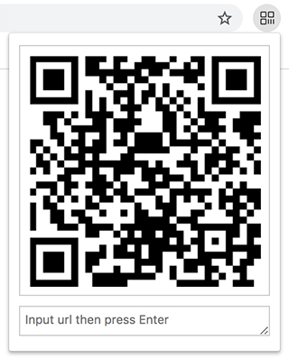

# chrome-plugin-qrcode

may be the best qrcode extension of the southern hemisphere

## Feature

- auto generate qrcode with current tab url
- custom the url:
  - `auto focus` text area -> input -> press enter
  - if input empty url, current url is default

## Install

1. Download the [zip](https://github.com/seasidesun/chrome-plugin-qrcode/archive/master.zip) file and unzip

2. Go to chrome://extensions/ and check the box for Developer mode in the top right.

3. Click the Load unpacked extension button in the top left and select the unzipped folder

## Screenshot

